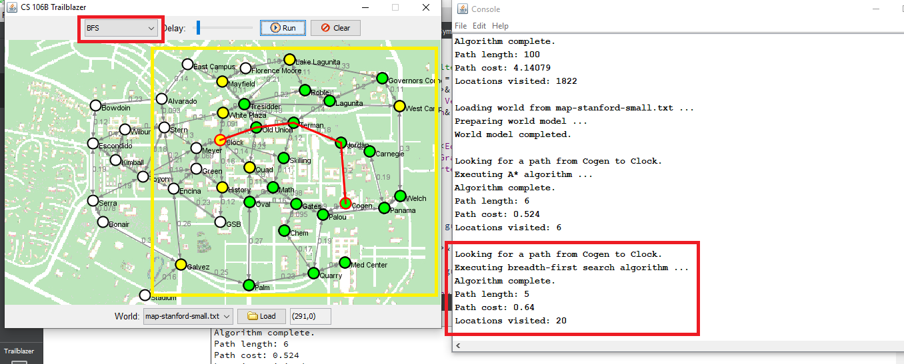
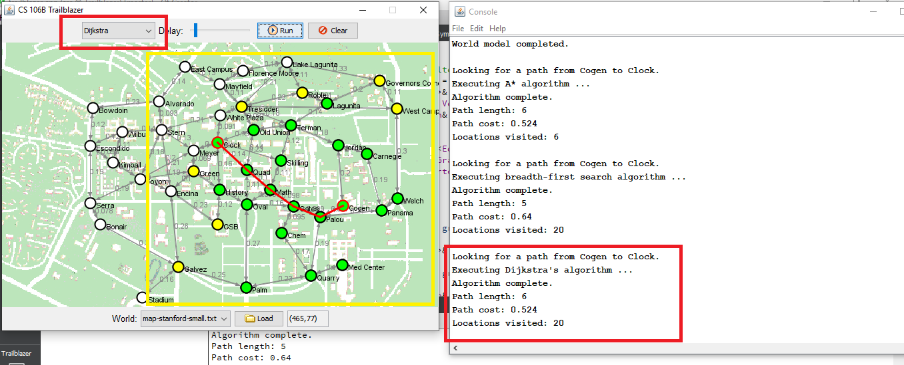
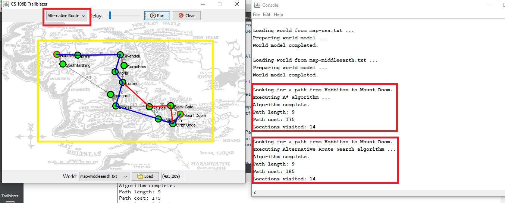
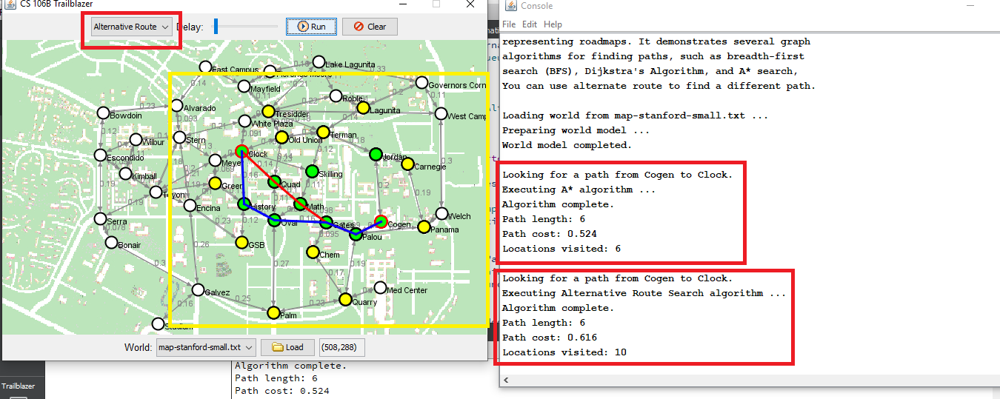
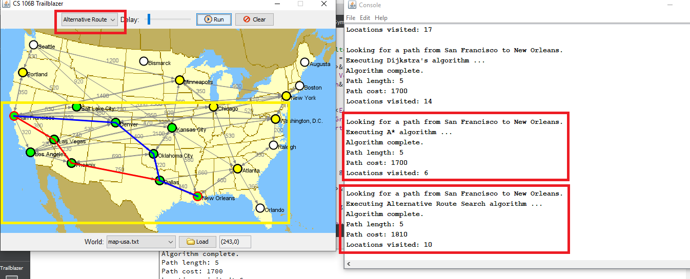

# Trailblazer

This project is one of the Assignment of CS 106B from stanford University.

Starter code and problem documentation can be found on the following website
http://web.stanford.edu/class/archive/cs/cs106b/cs106b.1172//assn/trailblazer.html

Finds path between two places in a map

Path searching was implemented by four diffrent algorithms:
### 1- BFS(Breadth-first search):
Finds a shortest path that has smallest number of nodes.

My Sollution - [Breadth-first search](https://github.com/Apurba000Biswas/Trailblazer/blob/master/src/trailblazer.cpp#L29)
#### Running Sollution:

  

  

  

  

### 2- Dijkstras Algorithm:
Finds a cheapest path that has lowest cost nodes.

My Sollution - [Dijkstras](https://github.com/Apurba000Biswas/Trailblazer/blob/master/src/trailblazer.cpp#L97)
#### Running Sollution:

  

  

  

### 3- A* Search:
Exactly does the dijkstras algorithm dose, onley faster. It Uses a Heuristics to guess the end position's path.

My Sollution - [A_Star](https://github.com/Apurba000Biswas/Trailblazer/blob/master/src/trailblazer.cpp#L160)
#### Running Sollution:

  

  

  

  

### 4- Alternative Route Search:
Finds an alternative path to reach the end position. It Uses A* / Dijkastras algortihm internally to finds the best alternative path after the orignal best path.(We Assume atleast 20% path should be diffrent than best path found by dijkstra/A* ).

My Sollution - [Alternative Route Search](https://github.com/Apurba000Biswas/Trailblazer/blob/master/src/trailblazer.cpp#L180)
#### Running Sollution:

  

  

  

  

#### NOTE : If you are Stanford CS 106B Student, Please Dont See the Source code. If you do you will violate the HONOR CODE